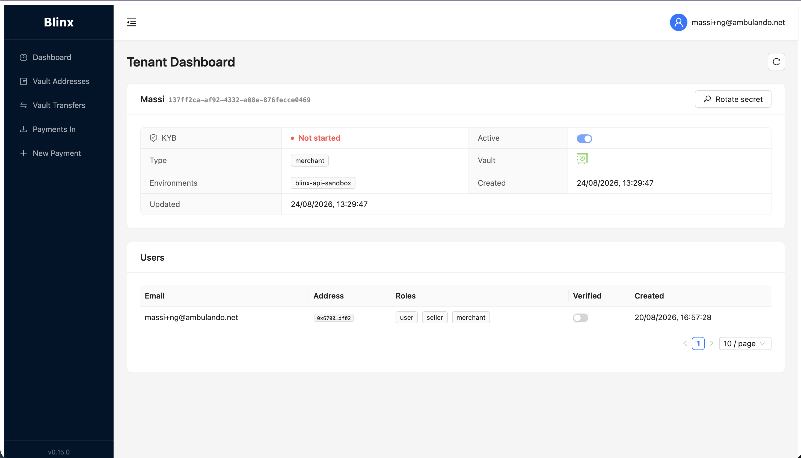

# Dashboard

**Route:** `/tenant/dashboard`

<figure><figcaption></figcaption></figure>

The Tenant Dashboard is your landing page. It summarises your tenant, lets you manage your API credentials, and lists the users attached to your tenant.

### Tenant overview

A card at the top shows your tenant's key details:

| Field                 | Meaning                                                                                      |
| --------------------- | -------------------------------------------------------------------------------------------- |
| **Name / ID**         | Your tenant's display name and unique identifier                                             |
| **Logo**              | Your brand logo, shown to payers on the payment page (set by link or image upload — see below) |
| **KYB**               | Know-Your-Business verification status — `Verified`, `Pending`, `Rejected`, or `Not started` |
| **Active**            | Whether the tenant is currently enabled                                                      |
| **Type**              | Tenant type (e.g. merchant)                                                                  |
| **Vault**             | A vault icon — **green** if a vault is provisioned for your tenant, **red** if not           |
| **Environments**      | The environments your tenant is configured for                                               |
| **Created / Updated** | Timestamps                                                                                   |

Use the **Refresh** button (top-right) to reload the latest data.

### Tenant logo

You can give your tenant a logo. It is shown to your payers on the payment page, so it's worth setting to make your checkout recognisable.

Set it in one of two ways:

* **Provide a link** — supply the URL of an image already hosted elsewhere (must be an `http(s)` address).
* **Upload an image** — upload an image file directly (PNG, JPEG, WebP or GIF, up to 5 MB). Blinx stores it and serves it from a public CDN URL.

Your tenant keeps a **single current logo** — setting a new one (by link or upload) replaces the previous one. Once set, the logo is returned as `logoUrl` wherever your tenant details are read.

### API credentials

Your tenant authenticates to the Blinx API with an **API key** and **API secret**.

* Click **Rotate secret** to generate a new secret. The current secret stops working immediately.
* The new credentials are shown **only once**. Copy them, or use **Download CSV** to save them, before closing the dialog. You must confirm you've copied each value before the dialog can be dismissed.

> **Keep credentials safe.** The secret cannot be retrieved again — if you lose it, rotate to get a new one.

### Users

A table lists the users belonging to your tenant:

| Column       | Description                                 |
| ------------ | ------------------------------------------- |
| **Email**    | The user's email address                    |
| **Address**  | Their wallet address (shortened)            |
| **Roles**    | Roles assigned to the user                  |
| **Verified** | Whether the user has completed verification |
| **Created**  | When the user was added                     |
