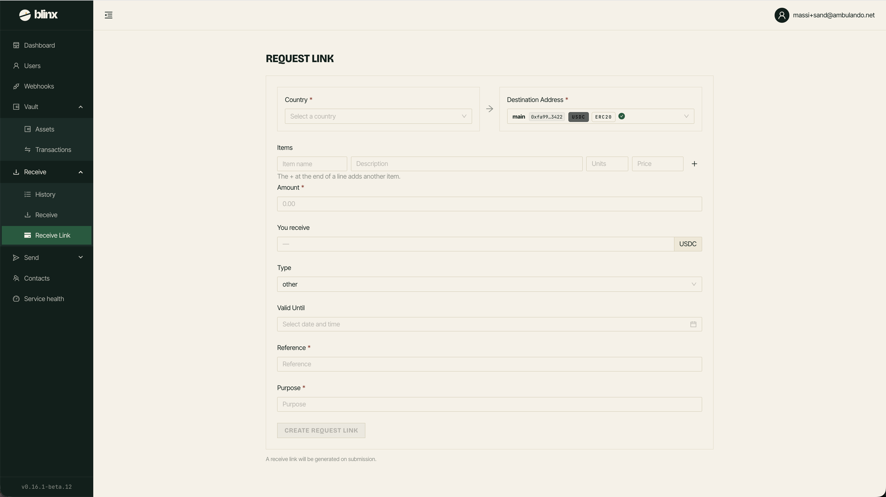

# Receive Link

**Route:** `/tenant/payments/new`

<figure><figcaption></figcaption></figure>

Use this page to create a **payment request** — a link you share with a payer so they can pay you. Blinx generates the link; you can copy it, open it, or email it to the payer.

### Creating a payment

Fill in the form:

| Field | Notes |
|---|---|
| **Amount** | The amount to request. Required |
| **Country** | The payer's country. Selecting it sets the **Currency** automatically |
| **Currency** | Filled in from the country — read-only |
| **Destination Address** | The vault address that will receive the funds. Only active addresses are listed; each option shows the shortened address, token, network, and a check for your default. The default address is pre-selected |
| **Type** | The reason for the payment (gift, bills, groceries, …). Defaults to **other** |
| **Valid Until** _(optional)_ | An expiry date and time for the payment link |
| **Reference** _(optional)_ | Your own reference for the payment |
| **Purpose** _(optional)_ | A description of the payment |

Click **Create Payment** to generate the link. The token and network sent with the request are taken from the destination address you chose.

### After creation

Once the payment is created you'll see a success screen with the payment link and these actions:

* **Copy** — copy the link to your clipboard.
* **Open** — open the payment page in a new tab.
* **Email** — send the link directly to a payer. You provide their name, the email address, a subject, and an optional message.
* **Create another** — reset the form to create a new payment. Your default destination address and the default type are restored.
