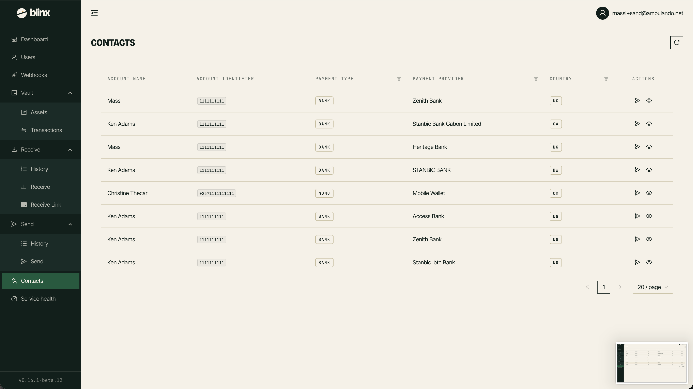

# Contacts

**Route:** `/tenant/payers`

<figure><figcaption></figcaption></figure>

The Contacts (Payers) page lists the payers/recipients your tenant works with so you can review and search them.

### The contacts list

Each entry shows the payer's recorded details including account name, account identifier, payment type (bank/momo), payment provider/institution, country, and more. The list is paginated.

### Filtering

You can narrow the list by:
- **Payment Type** — bank or mobile money (momo)
- **Country** — the payer's country  
- **Payment Provider** — the institution/network

You can also search and sort the list as needed.
