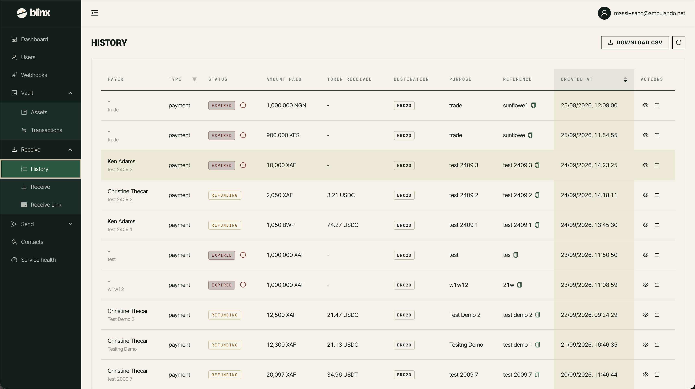

# Payments In

**Route:** `/tenant/payments`

<figure><figcaption></figcaption></figure>

This page lists the payments coming **into** your tenant — the money payers have sent in response to your payment requests — and lets you export them.

### The payments table

| Column | Description |
|---|---|
| **Purpose** | What the payment was for |
| **Status** | The payment status as a coloured tag. If a payment failed, a red **ⓘ** icon appears next to the tag — hover it to read the failure reason |
| **Country** | The payer's country |
| **Amount** | Amount received, in the incoming currency |
| **Token** | The token/stablecoin value of the payment |
| **Fees** | Fees charged |
| **Payer** | The payer's name. On a resolved payment (settled, refunding, refunded, or failed) with no payer recorded, a red **Missing** tag is shown. The purpose is repeated underneath |
| **Seller** | The seller associated with the payment |
| **Destination** | The destination network |
| **Created At** | When the payment was created — the table is sorted by this, newest first |

Click a column's sort control on **Created At** to change the order. Use **Refresh** to reload.

### Exporting

Click **Download CSV** to export the payments as a CSV file. The file is named with the current date and time.

### No tenant

If your account isn't linked to a tenant, this page shows a "No tenant" notice instead of the table.
