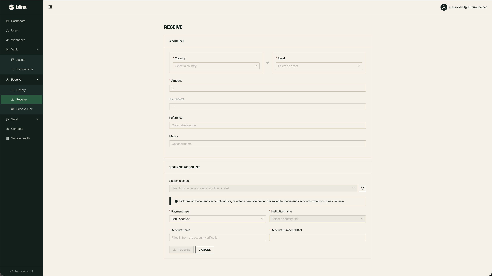

# Receive

**Route:** `/tenant/receive`

<figure><figcaption></figcaption></figure>

Use this page to create a receive/payment-in flow - allowing you to receive funds into your tenant's vault.

### Creating a receive

Fill in the form fields to configure how you want to receive funds:

| Field | Notes |
|---|---|
| **Country** | The source country of the funds |
| **Source Account/Customer** | Select an existing customer or create a new one |
| **Asset/Token** | Choose which asset you want to receive |
| **Amount** | The amount to receive |
| **Payment Details** | Institution and account details as required |

Once you submit, you'll be shown the payment details including the account to send funds to and any reference required.
