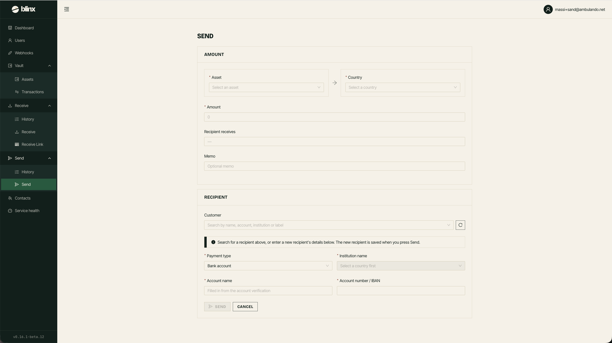

# Send

**Route:** `/tenant/send`

<figure><figcaption></figcaption></figure>

Use this page to send funds from your tenant to recipients.

### Creating a send

Fill in the form:

| Field | Notes |
|---|---|
| **Recipient** | Select an existing contact or create a new recipient |
| **Country** | Recipient's country |
| **Payment Type** | Bank transfer or mobile money |
| **Institution** | Select the receiving institution |
| **Account Details** | Account name and identifier |
| **Asset** | The asset to send from your vault |
| **Amount** | Amount to send (fiat) - the system will show you the quote |
| **Memo** | Optional memo/reference |

The form will show you a live quote including the amount the recipient receives and any fees.
