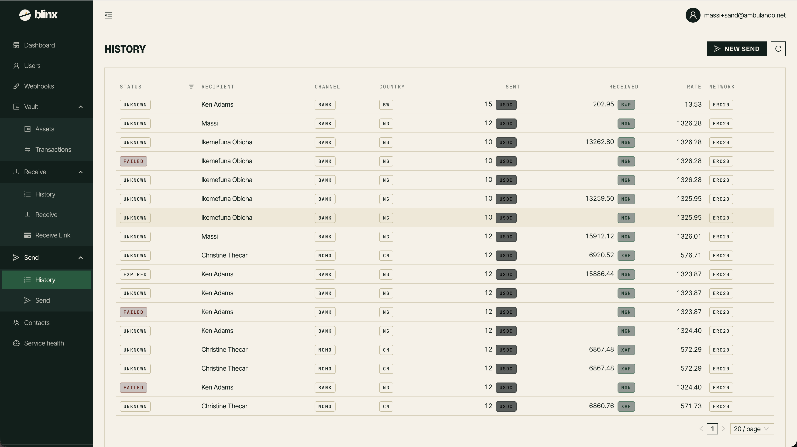

# Sends History

**Route:** `/tenant/sends`

<figure><figcaption></figcaption></figure>

This page lists all outgoing transfers (sends) from your tenant.

### The sends table

| Column | Description |
|---|---|
| **Status** | Current status of the transfer |
| **Recipient** | The recipient's details |
| **Channel** | Transfer channel (bank/momo) |
| **Country** | Recipient's country |
| **Sent** | Amount sent with currency |
| **Received** | Amount recipient receives with currency |
| **Rate** | Exchange rate applied |
| **Fees** | Fees charged |
| **Created** | When the send was created |
