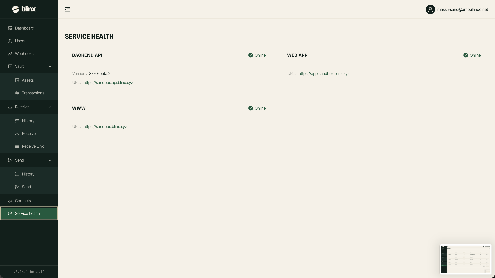

# Service Health

**Route:** `/tenant/healthcheck`

<figure><figcaption></figcaption></figure>

The Service Health page lets you check the connectivity and status of the various Blinx services.

### Services Monitored

The dashboard monitors the following services:

| Service | What it checks |
|---|---|
| **Backend API** | The core Blinx API service - checks version, build date, and readiness |
| **Web App** | The main web application (if configured) |
| **WWW Site** | The public website (if configured) |

Each service shows:
- **Status**: Online (green) or Offline (red)
- **Version**: The deployed version of the service
- **Build date**: When the service was built
- **Message**: Additional status information
- **Error**: Details if the service is unreachable
