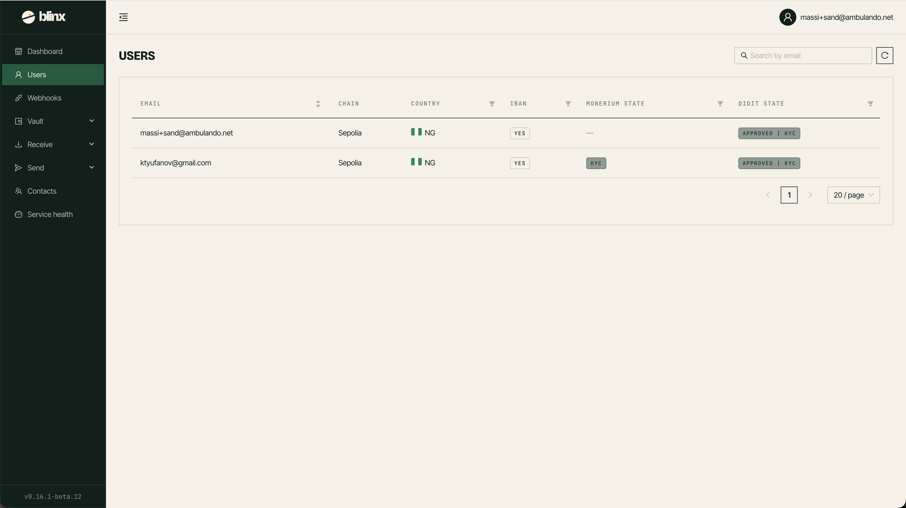

# Users

**Route:** `/users`

<figure><figcaption></figcaption></figure>

The Users page lists all users belonging to your tenant. You can view their details and verification status.

### The users list

| Column | Description |
|---|---|
| **Email** | The user's email address |
| **Address** | Their wallet address (shortened) |
| **Roles** | Roles assigned to the user |
| **Verified** | Whether the user has completed verification |
| **Created** | When the user was added |
