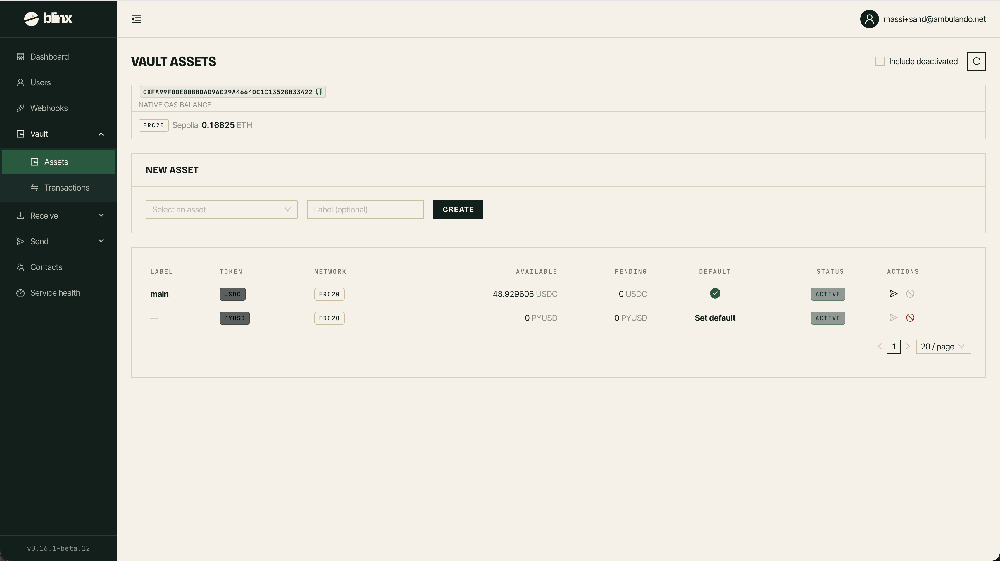

# Vault - Assets

**Route:** `/tenant/vault/addresses`

<figure><figcaption></figcaption></figure>

The Vault Assets page lets you manage your tenant's vault addresses - the wallet addresses that receive and hold funds for your tenant.

### The assets table

| Column | Description |
|---|---|
| **Label** | A custom label for the address (if set) |
| **Token** | The token/currency the address holds |
| **Network** | The blockchain network for this address |
| **Available** | Available balance for use |
| **Pending** | Balance that is pending confirmation |
| **Default** | Whether this is the default address (marked with a check) |
| **Status** | Active or Inactive |

### Managing addresses

- **Create new address**: Generate a new vault address for a specific asset/token
- **Set as default**: Make an address the default for receiving funds
- **Activate/Deactivate**: Enable or disable an address
- **Send**: Initiate a transfer from the vault address
- **View details**: See more information about the address
