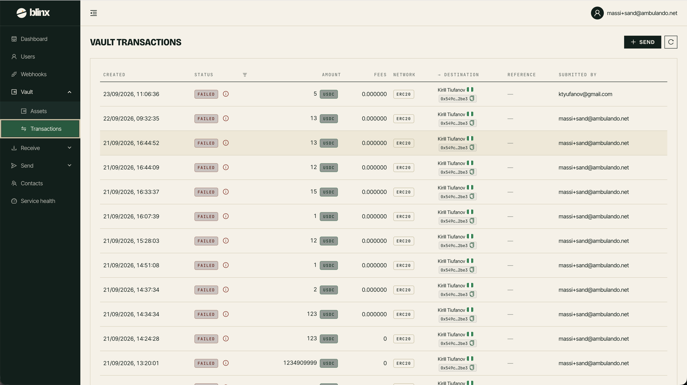

# Vault - Transactions

**Route:** `/tenant/vault/transactions`

<figure><figcaption></figcaption></figure>

The Vault Transactions page shows the history of transfers to and from your vault addresses.

### The transactions table

| Column | Description |
|---|---|
| **Created** | When the transaction was created |
| **Status** | Current status (created, pending, processing, completed, failed, etc.) |
| **Amount** | Transaction amount with token |
| **Fees** | Fees charged for the transaction |
| **Network** | The blockchain network |
| **Type** | Transaction type (send/receive/internal) |
| **From/To** | Source and destination addresses |

Hover over the info icon next to failed transactions to see the failure reason.
