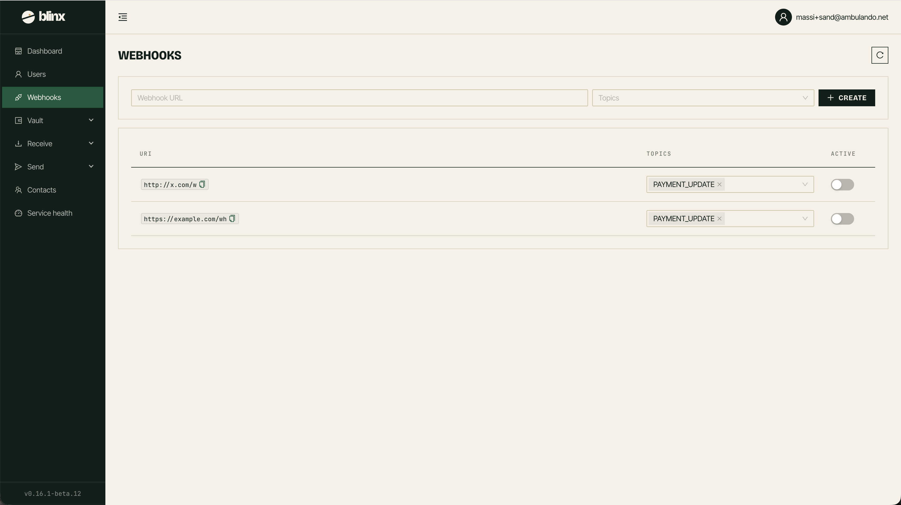

# Webhooks

**Route:** `/tenant/webhooks`

<figure><figcaption></figcaption></figure>

The Webhooks page lets you subscribe your own HTTPS endpoints to Blinx events, so your systems are notified as things happen instead of polling. Subscriptions are scoped to your tenant.

### What you can subscribe to

Each subscription has a delivery **URL** and one or more **topics**:

| Topic | Fires when… |
|---|---|
| `PAYMENT_UPDATE` | a payment changes state (created → settled / failed / …) |
| `TRANSFER_UPDATE` | a transfer changes state |

### Managing subscriptions

* **Add** — provide the delivery URL and pick at least one topic. The subscription is created and starts receiving matching events.
* **List** — see all subscriptions on your tenant, their URL, topics, and whether they're active.
* **Update** — change a subscription's topics or toggle it **active/inactive**. The delivery URL is fixed once created — to change it, remove the subscription and add a new one.

### Delivery & signing

Blinx `POST`s each matching event to your URL, **signed with your tenant's payment API secret** (the same secret you rotate on the Dashboard) — there is no separate per-webhook secret. Verify the signature on your side before trusting a delivery. Delivery is best-effort (a low-latency hint); reconcile authoritative state with the API when you need certainty.

Backed by `POST` / `GET /api/dashboard/tenant/webhooks` and `PATCH /api/dashboard/tenant/webhooks/:id`.
