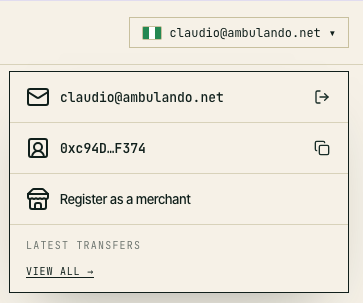
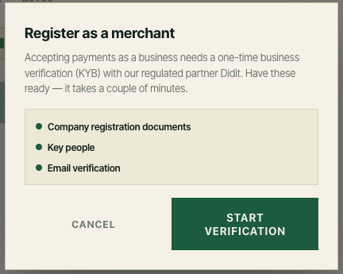

# Set up the sandbox

##

Everything in this documentation runs against the **sandbox** — no real transactions are created. This recipe covers the three things you need before you can call the API: how to reach the sandbox, what Blinx gives you (an **API key** and an **API secret**), and how to use them on a request.

***

#### What you get

| Item           | Value / where it comes from                                  | Purpose                                              |
| -------------- | ------------------------------------------------------------ | ---------------------------------------------------- |
| Base URL       | `https://sandbox.api.blinx.xyz`                              | Every sandbox request goes here                      |
| Healthcheck    | `GET https://sandbox.api.blinx.xyz/healthcheck`              | Unauthenticated liveness check — `200` when ready    |
| **API key**    | Issued with your tenant; shown once, on creation or rotation | Sent on **every** request as `x-api-key`             |
| **API secret** | Issued with your tenant; shown once, on creation or rotation | HMAC-SHA256 signing key — **never sent** on the wire |

Your tenant also carries an **Environments** field (visible on the dashboard). It must include the sandbox environment — Blinx sets it when your tenant is provisioned. Ask for it if your tenant only shows production.

> **Sandbox rules.** Providers run in sandbox mode: payouts are simulated, no live provider is contacted, and no money moves. See Sandbox behaviour for the test values the sandbox expects.

***

#### 0. Create your user

You need to create your user before you can access the API and Dashboard as a tenant.

1. Open the [Blinx App](https://app.sandbox.blinx.xyz) and enter your email address.
2. Blinx emails you a one-time code (OTP) — enter it to sign in.
3. You land on the **Send** page.
4. Proceed with verifying your identity via KYC - a banner will appear to guide you
5. Once your KYC is approved, you can now proceed to request a merchant account
   1. open the dropdown menu on the right top corner
      
   2. a banner will appear to guide you
      

Once your KYB has been approved, we will create your tenant account and will grant you access to the dashboard


#### 1. Sign in to the Merchant Dashboard

Your credentials live in the dashboard, so sign in first:

1. Open the Merchant Dashboard and enter your email address.
2. Blinx emails you a one-time code (OTP) — enter it to sign in.
3. You land on the **Tenant Dashboard** (`/tenant/dashboard`).

For what's on that page — tenant overview, environments, logo, users — see the [Dashboard → API credentials](https://blinx-merchant.gitbook.io/docs/dashboard) page of the Merchant Dashboard docs.

***

#### 2. Collect your API key and secret

Blinx issues an **API key** and an **API secret** with your tenant. You get them in two places, both shown **exactly once**:

* **At provisioning** — Blinx hands you the pair when the tenant is created. Copy it there; there is no page that displays it again afterwards.
* **Any time after that** — on the Tenant Dashboard's **API credentials** section, click **Rotate secret**. The dialog shows the key and the newly generated secret together, with a **Download CSV** option. You must confirm you've copied each value before it can be dismissed.

| Credential     | What it is                                              | Where it goes                                              |
| -------------- | ------------------------------------------------------- | ---------------------------------------------------------- |
| **API key**    | Your tenant's public identifier                         | `x-api-key` header on every request                        |
| **API secret** | The HMAC key both sides use to sign and verify requests | Stays with you — used to compute `x-signature`, never sent |

> **Rotate if you lose the secret.** The secret is stored encrypted so the server can verify signatures, but it is never displayed again. Rotating issues a new secret and **invalidates the old one immediately** — the API **key** itself is unchanged. Only a `tenant_admin` of the tenant can rotate.

> **Keep the secret out of your code.** Put it in an environment variable or your secrets manager; never in a request body, URL, or committed file.

***

#### 3. Check the sandbox is reachable

Before wiring up signing, confirm the base URL and the service itself:

```bash
curl https://sandbox.api.blinx.xyz/healthcheck
```

A `200` with `{"ready":true,...}` means the sandbox is up and `sandbox.api.blinx.xyz` is the right host. This endpoint needs **no** API key — it's the quickest sanity check. (`503` means the service is up but not ready, e.g. the database is unreachable.)

***

#### 4. Send your first signed request

Merchant endpoints (`/api/merchant/*`) are authenticated **per call** — there is no session or bearer token. Every request carries three headers:

```
signature = hex HMAC-SHA256( apiSecret, `${timestamp}.${METHOD}.${path}.${sha256hex(body)}` )
```

* `x-api-key` — your API key.
* `x-timestamp` — unix epoch **milliseconds**, within **±5 minutes** of server time.
* `x-signature` — the signature above; `path` is the request target (path **+ query**) exactly as sent, and `sha256hex(body)` hashes the **raw** body bytes.

The quickest way to sign is the bundled CLI signer, which also prints a ready-to-run `curl`:

```bash
export BLINX_API_KEY=<your-api-key>
export BLINX_API_SECRET=<your-api-secret>

ts-node scripts/sign-payment-request.ts \
  --method GET --url /api/merchant/data/NG \
  --curl --base-url https://sandbox.api.blinx.xyz
```

Add `--method POST --body '{…}'` for signed POSTs. Credentials can also be passed with `--api-key` / `--api-secret` instead of env vars. Full walkthrough: Signing a request from the CLI.

Prefer Postman? The ready-made `Blinx Merchant API` collection has a pre-request script that signs for you — set `sandbox_url` to `https://sandbox.api.blinx.xyz` and your `api_key` / `api_secret` on the collection's **Variables** tab, then follow Test the Blinx system with Postman.

> **Sign the exact bytes.** The signature covers the raw body as sent — never reformat or re-serialize after signing, and don't alter the path, query, or case of the URL, or you'll get `401`.

***

#### Sandbox behaviour

* **Payout test numbers** — on the hosted payment page, account identifier `1111111111` drives the sandbox to a **settled** payment; `0000000000` drives it to **failed**.
* **Simulated providers** — swaps, exchange orders, and payouts advance through canned status sequences rather than real provider calls.
* **Hosted payment page** — every created payment returns a `redirectUrl` on the sandbox domain; the payer completes the payment there.

Full end-to-end walkthrough: Test the Blinx system with Postman.

***

#### Troubleshooting

| Symptom                                              | Likely cause                                                                                              |
| ---------------------------------------------------- | --------------------------------------------------------------------------------------------------------- |
| `401 AUTH_401_NO_CREDENTIALS`                        | `x-api-key` / `x-timestamp` / `x-signature` missing from the request                                      |
| `401 AUTH_401_INVALID_API_KEY`                       | Wrong key, or the tenant is inactive / deprovisioned — check the key you copied from the dashboard        |
| `401 AUTH_401_INVALID_SIGNATURE`                     | Wrong secret, body or path altered after signing, or **clock skew** — keep your machine within ±5 minutes |
| `503` from `/healthcheck`                            | Sandbox is up but not ready (database unreachable) — retry                                                |
| Connection refused / DNS error                       | Wrong host — the sandbox base URL is `https://sandbox.api.blinx.xyz`                                      |
| Old secret stopped working after a colleague rotated | Expected — rotation invalidates the previous secret immediately; re-copy the pair from the dialog         |

***

#### Next steps

* Create a Payment — quote, create, hand off to the payer, read the outcome.
* Country Data — limits and travel-rule fields per country.
* Signing requests in Postman — how the pre-request script signs.
* [API documentation](https://blinx-merchant.gitbook.io/docs) — the full endpoint reference.

_Updated: 06 October 2026 14:57_
